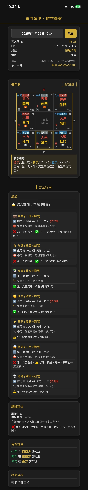

# 🔮 奇門遁甲 - 時空羅盤 (預覽版)

> **掌中乾坤，運籌帷幄。**  
> 專為現代人設計的奇門遁甲排盤工具，融合傳統易學與現代科技，讓決策更精準，出行更順遂。

## 注意
- 此專案目前仍處於預覽階段，部分功能可能尚未完善。
- 此專案雖然與市面軟體比對未發現計算錯誤，惟作者亦為初學者，故仍無法保證完全準確。
- 使用者應對自己的決策負責，本專案僅提供參考，請勿將本專案作為事情的決策依據，作者不為此專案造成的任何情況負責。

## ✨ 特色功能 (Features)

### 🎯 核心功能
- **精準排盤**：支援「真太陽時」校正，確保排盤數據精確無誤。
- **時空羅盤**：獨家「羅盤模式」，結合手機方位，直觀顯示吉凶方位。
- **即時運算**：自動計算局數、旬首、值符、值使，毫秒級響應。

### 📱 現代化體驗
- **PWA 離線使用**：支援安裝到手機桌面，**無網路也能隨時隨地排盤**，是您隨身的決策顧問。
- **極致美學**：深色模式設計，搭配流金質感 UI，閱讀舒適且專業。
- **新手友善**：內建「選擇困難」與「出遊吉凶」嚮導，不懂易經也能輕鬆上手。

---

## 📸 預覽

  

---

## 🚀 如何開始 (Getting Started)

### 線上使用
直接訪問我們的網頁版即可開始使用（建議使用 Chrome 或 Safari 瀏覽器）。

### 📲 安裝為 App (PWA)
本專案支援 **Progressive Web App (PWA)** 技術，您可以將其安裝為原生應用程式體驗：

1. **iOS (Safari)**:
   - 點擊底部「分享」按鈕
   - 選擇「加入主畫面 (Add to Home Screen)」
   - **✨ 即使在飛航模式或無網路環境下，依然可以完整使用所有排盤功能！**

2. **Android (Chrome)**:
   - 點擊右上角選單
   - 選擇「安裝應用程式」或「加到主畫面」

---

## 📖 使用指南

### 1. 選擇困難模式
遇到 A/B 選項猶豫不決？
- 設定好問題時間。
- 觀察 **生門 (A)** 與 **開門 (B)** 落宮。
- 比較宮位內的門、星、神吉凶，高分者勝。

### 2. 出遊吉凶模式
- 確定旅遊目的地相對自家的方位。
- 查看該方位落宮的八門吉凶。
- **吉門 (生/開/休)**：適合前往，旅途愉快。
- **凶門 (驚/傷/死)**：建議改期或更換地點。

---

## 🛠️ 技術棧 (Tech Stack)

- **Core**: HTML5, Vanilla JavaScript (ES6+)
- **Styling**: CSS3 (Variables, Flexbox, Grid), Glassmorphism effects
- **PWA**: Service Worker, Web App Manifest
- **Fonts**: Google Fonts (Inter, Roboto)

